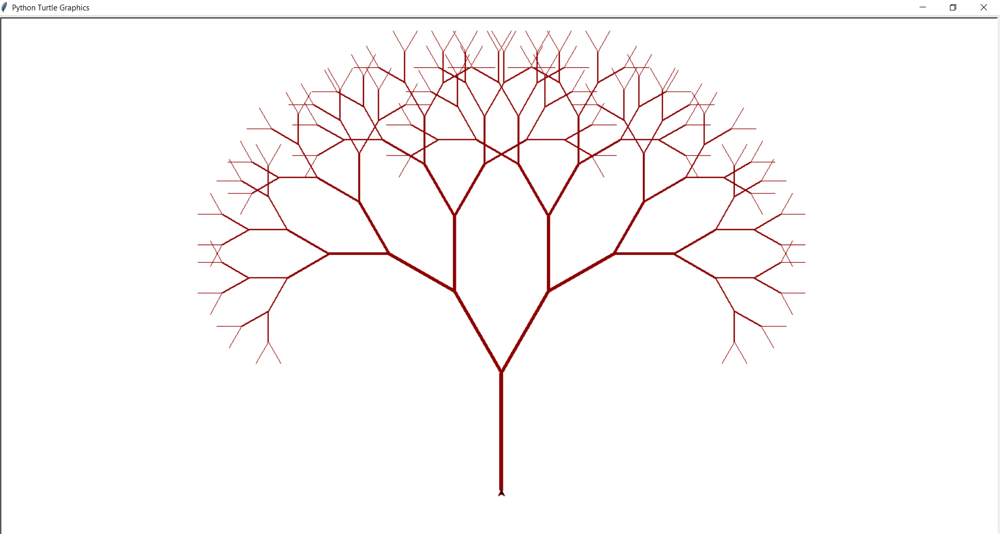

# Покрокова інструкція виконання фінального проєкту

## Завдання 1. Структури даних. Сортування. Робота з однозв'язним списком

Для реалізації однозв'язного списку (приклад реалізації можна взяти з конспекту) необхідно:

- написати функцію, яка реалізує реверсування однозв'язного списку, змінюючи посилання між вузлами;
- розробити алгоритм сортування для однозв'язного списку, наприклад, сортування вставками або злиттям;
- написати функцію, що об'єднує два відсортовані однозв'язні списки в один відсортований список.

## Завдання 2. Рекурсія. Створення фрактала “дерево Піфагора” за допомогою рекурсії

Необхідно написати програму на Python, яка використовує рекурсію для створення фрактала “дерево Піфагора”. Програма має візуалізувати фрактал “дерево Піфагора”, і користувач повинен мати можливість вказати рівень рекурсії.


## Завдання 3. Дерева, алгоритм Дейкстри

Розробіть алгоритм Дейкстри для знаходження найкоротших шляхів у зваженому графі, використовуючи бінарну купу. Завдання включає створення графа, використання піраміди для оптимізації вибору вершин та обчислення найкоротших шляхів від початкової вершини до всіх інших.

## Завдання 4. Візуалізація піраміди

Наступний код виконує побудову бінарних дерев. Виконайте аналіз коду, щоб зрозуміти, як він працює.

```python
import uuid

import networkx as nx
import matplotlib.pyplot as plt

class Node:
def **init**(self, key, color="skyblue"):
self.left = None
self.right = None
self.val = key
self.color = color # Додатковий аргумент для зберігання кольору вузла
self.id = str(uuid.uuid4()) # Унікальний ідентифікатор для кожного вузла

def add_edges(graph, node, pos, x=0, y=0, layer=1):
if node is not None:
graph.add_node(node.id, color=node.color, label=node.val) # Використання id та збереження значення вузла
if node.left:
graph.add_edge(node.id, node.left.id)
l = x - 1 / 2 ** layer
pos[node.left.id] = (l, y - 1)
l = add_edges(graph, node.left, pos, x=l, y=y - 1, layer=layer + 1)
if node.right:
graph.add_edge(node.id, node.right.id)
r = x + 1 / 2 ** layer
pos[node.right.id] = (r, y - 1)
r = add_edges(graph, node.right, pos, x=r, y=y - 1, layer=layer + 1)
return graph

def draw_tree(tree_root):
tree = nx.DiGraph()
pos = {tree_root.id: (0, 0)}
tree = add_edges(tree, tree_root, pos)

colors = [node[1]['color'] for node in tree.nodes(data=True)]
labels = {node[0]: node[1]['label'] for node in tree.nodes(data=True)} # Використовуйте значення вузла для міток

plt.figure(figsize=(8, 5))
nx.draw(tree, pos=pos, labels=labels, arrows=False, node_size=2500, node_color=colors)
plt.show()

# Створення дерева

root = Node(0)
root.left = Node(4)
root.left.left = Node(5)
root.left.right = Node(10)
root.right = Node(1)
root.right.left = Node(3)

# Відображення дерева

draw_tree(root)
```


Використовуючи як базу цей код, побудуйте функцію, що буде візуалізувати бінарну купу.

> Примітка. Суть завдання полягає у створенні дерева із купи.

## Завдання 5. Візуалізація обходу бінарного дерева

Використовуючи код із завдання 4 для побудови бінарного дерева, необхідно створити програму на Python, яка візуалізує обходи дерева: у глибину та в ширину.

Вона повинна відображати кожен крок у вузлах з різними кольорами, використовуючи 16-систему RGB (приклад `#1296F0`). Кольори вузлів мають змінюватися від темних до світлих відтінків, залежно від послідовності обходу. Кожен вузол при його відвідуванні має отримувати унікальний колір, який візуально відображає порядок обходу.

> Примітка. Використовуйте стек та чергу, НЕ рекурсію

## Завдання 6. Жадібні алгоритми та динамічне програмування

Необхідно написати програму на Python, яка використовує два підходи — жадібний алгоритм та алгоритм динамічного програмування для розв’язання задачі вибору їжі з найбільшою сумарною калорійністю в межах обмеженого бюджету.

Кожен вид їжі має вказану вартість і калорійність. Дані про їжу представлені у вигляді словника, де ключ — назва страви, а значення — це словник з вартістю та калорійністю.

```python
items = {
"pizza": {"cost": 50, "calories": 300},
"hamburger": {"cost": 40, "calories": 250},
"hot-dog": {"cost": 30, "calories": 200},
"pepsi": {"cost": 10, "calories": 100},
"cola": {"cost": 15, "calories": 220},
"potato": {"cost": 25, "calories": 350}
}
```

Розробіть функцію `greedy_algorithm` жадібного алгоритму, яка вибирає страви, максимізуючи співвідношення калорій до вартості, не перевищуючи заданий бюджет.

Для реалізації алгоритму динамічного програмування створіть функцію `dynamic_programming`, яка обчислює оптимальний набір страв для максимізації калорійності при заданому бюджеті.

## Завдання 7. Використання методу Монте-Карло

Необхідно написати програму на Python, яка імітує велику кількість кидків кубиків, обчислює суми чисел, які випадають на кубиках, і визначає ймовірність кожної можливої суми.

Створіть симуляцію, де два кубики кидаються велику кількість разів. Для кожного кидка визначте суму чисел, які випали на обох кубиках. Підрахуйте, скільки разів кожна можлива сума (від 2 до 12) з’являється у процесі симуляції. Використовуючи ці дані, обчисліть імовірність кожної суми.

На основі проведених імітацій створіть таблицю або графік, який відображає ймовірності кожної суми, виявлені за допомогою методу Монте-Карло.

Таблиця ймовірностей сум при киданні двох кубиків виглядає наступним чином.


Порівняйте отримані за допомогою методу Монте-Карло результати з аналітичними розрахунками, наведеними в таблиці вище.

## Критерії прийняття фiнального проєкту

### Завдання 1:

- Реалізовано функцію реверсування однозв'язного списку, яка змінює посилання між вузлами. Код виконується.

- Програмно реалізовано алгоритм сортування (функцію) для однозв'язного списку. Код виконується.

- Реалізовано функцію, що об'єднує два відсортовані однозв'язні списки в один відсортований список. Код виконується.

### Завдання 2:

- Код виконується. Програма візуалізує фрактал “дерево Піфагора”.

- Користувач має можливість вказати рівень рекурсії.

### Завдання 3:

- Програмно реалізовано алгоритм Дейкстри для знаходження найкоротшого шляху у графі з використанням бінарної купи (піраміди).

- У межах реалізації завдання створено граф, використано піраміду для оптимізації вибору вершин та виконано обчислення найкоротших шляхів від початкової вершини до всіх інших.

### Завдання 4:

- Код виконується. Функція візуалізує бінарну купу.

### Завдання 5:

- Програмно реалізовано алгоритми DFS і BFS для візуалізації обходу дерева в глибину та в ширину. Використано стек та чергу.

- Кольори вузлів змінюються від темних до світлих відтінків залежно від порядку обходу.

### Завдання 6:

- Програмно реалізовано функцію, яка використовує принцип жадібного алгоритму. Код виконується і повертає назви страв, максимізуючи співвідношення калорій до вартості, не перевищуючи заданий бюджет.

- Програмно реалізовано функцію, яка використовує принцип динамічного

програмування. Код виконується і повертає оптимальний набір страв для максимізації калорійності при заданому бюджеті.

### Завдання 7:

- Програмно реалізовано алгоритм для моделювання кидання двох ігрових кубиків і побудови таблиці сум та їх імовірностей за допомогою методу Монте-Карло.

- Код виконується та імітує велику кількість кидків кубиків, обчислює суми чисел, які випадають на кубиках, підраховує, скільки разів кожна можлива сума з’являється у процесі симуляції, і визначає ймовірність кожної можливої суми.

- Створено таблицю або графік, який відображає ймовірності кожної суми, виявлені за допомогою методу Монте-Карло.

- Зроблено висновки щодо правильності розрахунків шляхом порівняння отриманих за допомогою методу Монте-Карло результатів та результатів аналітичних розрахунків. Висновки оформлено у вигляді файлу `readme.md` фінального завдання.

---

# Висновки по завданню

## Завдання 1. Структури даних. Сортування. Робота з однозв'язним списком

> ### Опис функцій
>
> #### `reverse(self)`
>
> Реверсує однозв'язний список, змінюючи посилання між вузлами. Використовуються три змінні:
>
> - **prev**: Зберігає попередній вузол.
> - **current**: Ітерується по списку.
> - **next_node**: Зберігає наступний вузол, щоб не втратити доступ до нього під час зміни посилань.
>
> #### `insertion_sort(self)`
>
> Сортує список методом вставки.
>
> - **sorted_head**: Утримує голову відсортованого часткового списку.
> - **\_sorted_insert**: Вставляє новий вузол у відсортований список у правильне місце.
>
> #### `merge_sorted_lists(head1, head2)`
>
> Зливає два відсортовані списки в один відсортований список. Використовує "допоміжний" вузол (`dummy`) для полегшення з'єднання вузлів.

```python
### Оригінальний список:

`1 -> 2 -> 3 -> None`

### Реверсований список:

`3 -> 2 -> 1 -> None`

### Несортований список:

`3 -> 1 -> 2 -> None`

### Відсортований список:

`1 -> 2 -> 3 -> None`

### Перший список:

`1 -> 3 -> 5 -> None`

### Другий список:

`2 -> 4 -> 6 -> None`

### Об'єднаний список:

`1 -> 2 -> 3 -> 4 -> 5 -> 6 -> None`
```

## Завдання 2. Рекурсія. Створення фрактала “дерево Піфагора” за допомогою рекурсії

> ### Функція `draw_tree`
>
> **Параметри:**
>
> - `branch_length`: довжина початкової гілки.
> - `angle`: кут між гілками.
> - `level`: рівень рекурсії.
> - `initial_thickness`: початкова товщина гілок.
>
> **Процес:**
>
> 1. Якщо рівень рекурсії менше або дорівнює нулю, функція завершується.
> 2. Малюється основна гілка за допомогою `turtle.forward(branch_length)`.
> 3. Рекурсивно малюються праві та ліві гілки:
>
> - Права гілка малюється після повороту на кут `angle`.
> - Ліва гілка малюється після повороту на `2 * angle` від початкової позиції.
>
> 4. Після малювання обох гілок черепашка повертається у вихідне положення за допомогою `turtle.right(angle)` та `turtle.backward(branch_length)`.
>
> ### Функція `main`
>
> **Процес:**
>
> 1. Запитує у користувача рівень рекурсії.
> 2. Перевіряє коректність введення (повинно бути невід'ємне ціле число).
> 3. Налаштовує екран `turtle` та початкову позицію черепашки:
>
> - Фон екрану встановлюється білим.
> - Черепашка розташована так, щоб дерево було видиме і вищим.
>
> 4. Викликає функцію `draw_tree` для малювання фрактала з заданими параметрами.
> 5. Завершує виконання малювання.
>
> ### Висновки
>
> - **Ефективність:** Рекурсивний підхід дозволяє легко малювати складні фрактальні структури. Розмір і товщина гілок можна налаштувати для досягнення бажаного вигляду.
> - **Читабельність:** Код добре структурований, що спрощує його розуміння та модифікацію. Функції мають чітко визначені завдання, що полегшує їх тестування та налагоджен


